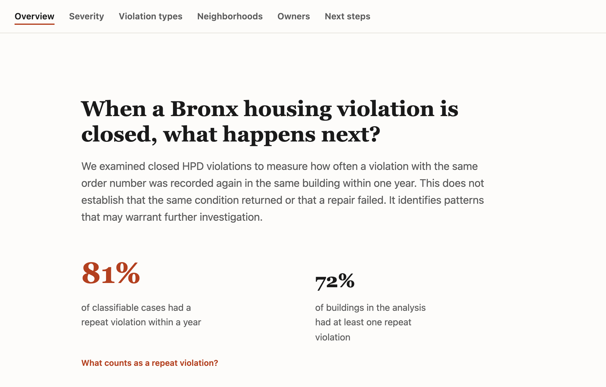
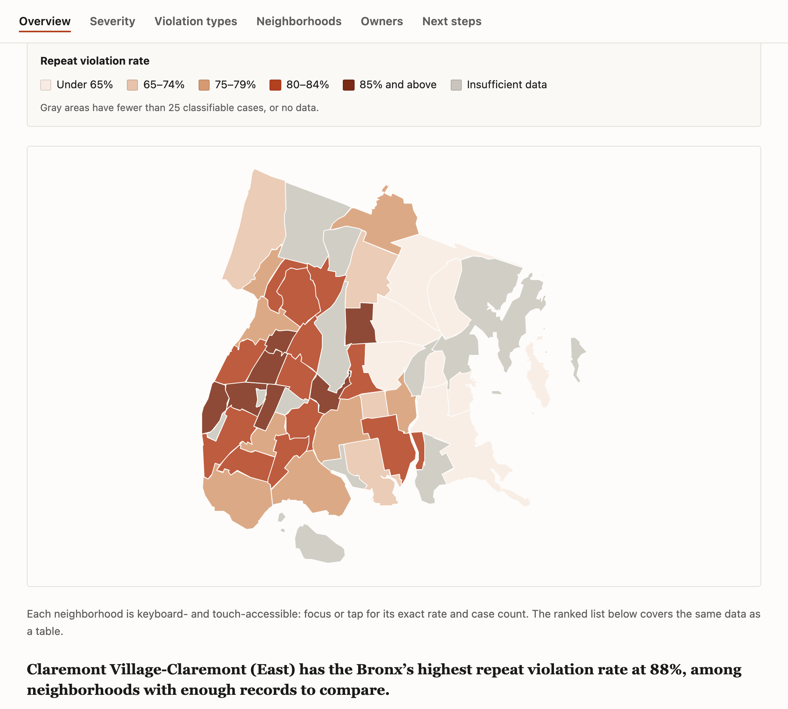

# Bronx Housing Violation Recurrence

**[Live site →](https://housing-violations-recurrence.vercel.app/)**

A data journalism site analyzing 653K+ NYC HPD housing violation records to answer one question: **when a housing violation gets marked "closed," does the problem actually go away?**

Built with a fully static architecture — a Node pipeline pulls and analyzes the data once at build time, so the deployed site never touches the source API or exposes any credentials.



## The finding

Across 431,572 closed violations in the Bronx (2024–2026), **81% recur within a year** of being closed. Severity class barely matters — Class C ("immediately hazardous") violations recur at nearly the same rate as lower-severity ones, suggesting the close-out process itself, not the violation type, is the weak point. The site breaks this down by severity, violation category, neighborhood, and property owner, with a methodology section covering the statistical choices behind the numbers.



## Why this project is interesting technically

- **Real dataset, real scale.** Not a toy CSV — pulls directly from NYC Open Data's Socrata API (8.3M+ rows citywide before filtering), using **keyset pagination** (`WHERE id > last_seen_id`, not `OFFSET`) so fetch time stays linear instead of degrading as the dataset grows.
- **Survival-analysis-style censoring.** A violation closed 3 weeks ago hasn't had a fair chance to "recur" within the 365-day window yet — counting it as a negative would bias the rate downward. Those cases are explicitly tracked as **censored** and excluded from the rate, not silently miscounted.
- **Statistical guardrails against small-sample noise.** Every rate-based ranking (by violation type, neighborhood, owner) enforces a minimum volume floor before a rate is shown, and the methodology section includes a scatterplot that visually demonstrates *why* — low-volume buildings scatter across the full 0–100% range, high-volume ones converge.
- **Security-conscious pipeline design.** The Socrata API token lives only in a gitignored `.env`, read only inside a standalone Node script (`scripts/fetch-data.js`) that never ships to the browser. The React app only ever fetches pre-computed static JSON — no live API calls, no credentials in the client bundle, deployable anywhere as pure static files.
- **Self-derived data categorization.** The dataset has no clean "violation type" field — violation types were extracted from free-text legal citations via regex, with a specific compliance-cadence category (an annual bedbug-filing requirement) identified and visually distinguished from genuine repeat-repair failures rather than skewing the analysis.
- **Debugged real rendering bugs, not just logic bugs.** Caught and fixed a Chromium compositing issue where Leaflet's internally-transformed map panes could visually bleed through a sibling `position: sticky` nav bar despite correct z-index — root-caused via live `getBoundingClientRect()`/computed-style inspection rather than guessing, and fixed with a proper CSS stacking-context boundary (`isolation: isolate`).
- **Automated data refreshes.** A scheduled GitHub Actions workflow re-runs the fetch pipeline monthly and commits updated data automatically, so the analysis doesn't go stale.

## Tech stack

| Layer | Choice |
|---|---|
| Data pipeline | Node.js (native `fetch`, no HTTP client dependency) |
| Frontend | React 19 + Vite |
| Charts | Recharts (bar, donut, log-scale scatter) |
| Map | react-leaflet + Leaflet, custom single-hue choropleth |
| Styling | Hand-written CSS, no framework |
| Automation | GitHub Actions (scheduled cron + manual dispatch) |

## Architecture

```
scripts/fetch-data.js   →  public/data/*.json, *.geojson   →   React app (static fetch only)
   (Node, build-time,          (committed, static)               (browser, no API calls)
    reads .env token)
```

`scripts/fetch-data.js` is a standalone script — never imported by the app — that:
1. Pulls Bronx violations from Socrata via keyset pagination, with a local disk cache to avoid re-hitting the API during development
2. Computes recurrence, censoring, and severity/neighborhood/owner/violation-type aggregations
3. Pulls and trims official NYC NTA (neighborhood) boundary polygons for the choropleth
4. Writes everything to small static JSON/GeoJSON files under `public/data/`

The React app (`src/`) only ever reads those static files via `fetch('/data/...')` — it has no knowledge of Socrata, the API token, or any live data source.

## Running locally

```bash
npm install
echo "SOCRATA_APP_TOKEN=your_token_here" > .env   # get a free token at dev.socrata.com
npm run fetch-data   # pulls + rebuilds public/data/ (~3.5 min for a fresh pull)
npm run dev
```

`npm run fetch-data` only needs to be re-run when you want fresh data — the site itself (`npm run dev` / `npm run build`) just reads the already-generated static files.

## Data & limitations

Source: [NYC HPD Housing Maintenance Code Violations](https://data.cityofnewyork.us/Housing-Development/Housing-Maintenance-Code-Violations/wvxf-dwi5) (Socrata dataset `wvxf-dwi5`). This data tracks violation *records*, not verified ground truth — it can't distinguish a landlord neglecting a repair from a genuinely hard-to-fix piece of infrastructure, and owner-level analysis is limited to HPD registration numbers since the dataset doesn't include owner names (a full portfolio view would require joining HPD's separate Registration Contacts dataset).
